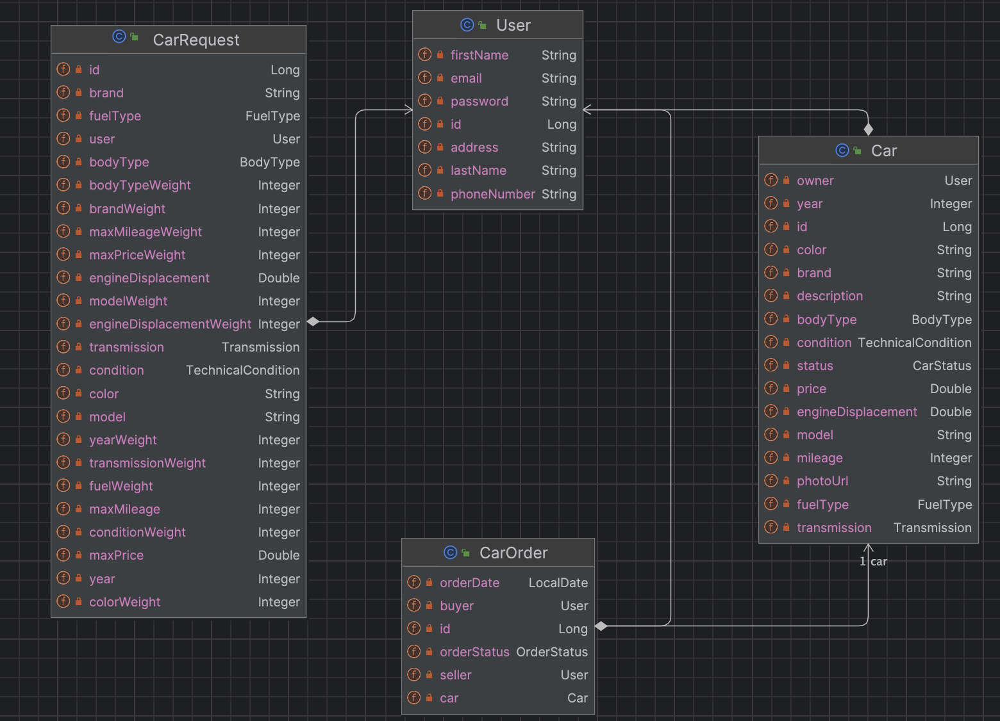

# Car Dealership

## Project description

> Car dealership is a web app designed to serve as a car marketplace/dealership.
> This application allows managing the process of car sales and orders between users.

## Table of Contents

- [Features](#features)
- [Technologies Used](#technologies-used)
- [Technical Details](#technical-details)
  - [Cars and Orders Lifecycle](#cars-and-orders-lifecycle)
  - [Project Structure](#project-structure)
  - [Entities](#entities)
  - [Data Access Layer](#data-access-layer)
  - [Application Logic Layer](#application-logic-layer)
  - [Presentation Layer](#presentation-layer)
  - [Exceptions](#exceptions)
  - [Car Requesting](#car-requesting)
  - [Design Patterns](#design-patterns)
  - [Security](#security)
  - [Testing](#testing)
- [Getting Started](#getting-started)

## Features

- Users related:
  - Register and log in
  - View and edit user information
- Cars related:
  - Add a new car for sale
  - View car details
  - Delete a car
  - Edit car details
  - View user's cars for sale
  - View all available cars
  - View car photos
- Orders related:
  - Create a new order for a car
  - View order details
  - Confirm an order
  - Complete an order
  - Cancel an order
  - Download order PDF
  - Download order TXT
- Requests related:
  - Create a request for a car
  - View request details with automated car suggestions
  - Edit a request
  - Delete a request
  - View all user's requests

## Technologies used

- Java 21
- Spring Boot 3.2.3 (Web, Data, Security)
- Thymeleaf
- HTML, CSS, JS, Bootstrap
- Liquibase
- MySQL
- Lombok
- Maven
- Apache PDFBox
- JUnit 5
- Mockito

## Technical details

This section contains a description of the main decisions I made while working on this project.
Note that the project code contains documentation comments for every method and class, so if you need detailed 
information on something, go ahead and generate JavaDoc.

### Cars and orders lifecycle

In this application, for user convenience, users are both buyers and sellers, as in other marketplace services.

For car and order entities, I decided to use logical deletion for the purpose of saving order history and user
comfort. With this approach, when an order is canceled by one of the users, they will both see the updated order, 
without confusion because the order doesn't just disappear. If, for example, the seller has already sold the car and 
wants to refuse the buyer, then when the order is deleted, the buyer will not understand what happened when they enter 
the system. The same situation would occur if everything happened the other way around.

When a user creates an order for a specific car, it has a `NEW` state, and that means the next step is for the seller 
to confirm the order. When the seller confirms the order, it has a `CONFIRMED` state, and that means the users have to 
meet and make a deal. After a successful deal, the buyer needs to "complete" the order, after which the order gets a 
`COMPLETED` state and will be moved to finished orders. At any of these steps, the order can be canceled by both the 
buyer and the seller, and it will get a `CANCELED` state.

When a new car is added, it has an `AVAILABLE` state. When it is ordered, the state is updated to `ORDERED`, and the 
car can not be ordered anymore. If the order is canceled, the car becomes `AVAILABLE` again. If the order is completed, 
the car becomes `ARCHIVED` and is saved in the system for the same historical purpose. When user wants to delete the
car, it just becomes `ARCHIVED` and is saved in the system, but can not be ordered anymore.

### Project structure

The project has a three-tier Architecture:

| Layer                                          | Responsibilities                                                                                     | 
|------------------------------------------------|------------------------------------------------------------------------------------------------------|
| **Presentation layer (Controllers and views)** | Controllers accept requests and send prepared response. Views are presenting the information itself. |
| **Application logic layer (Services)**         | Provide logic to operate on the data from the DB and the client.                                     |
| **Data access layer (Repositories)**           | Represents a connection between the database and the application.                                    |

### Entities

There are 4 entities in the project: Car, CarOrder, CarRequest, User. Their relations are displayed on the diagram.

> The Seller field was added to CarOrder to get easier access to the user and also to make the relation more obvious.
> Also, the "car" prefix was added to order and request to avoid problems with the database and for better understanding. 

### Data access layer

There are 4 repositories, one for each entity. CarRequestRepository and CarRepository have methods that work
with pagination. Additionally, CarRepository retrieves cars by specification. Specification methods are declared in the
CarSpecifications utility class.

I also wanted to use Spring Projections to create special DTOs in case all the data is not needed, but it turned out
that such a solution could interfere with the logic of the application so far, and due to a lack of time, I decided to 
leave it as it is.

### Application logic layer

There are 8 services that provide the business logic. Four of them are related to entities, and there are also
services for car suggestions, working with images, and document generation.

Please note that the program is designed to work with the English language. If you try to generate a PDF document with
Cyrillic characters, they will be displayed incorrectly.

User permissions are validated both on the frontend and the backend, in case a request is sent without using the
frontend pages, so that the system works correctly.

User permission checks could be implemented using the `@PreAuthorize` annotation, but in that case, it would require
multiple database accesses, so I settled on the simpler approach.

### Presentation layer

In the project, I use the `GET` method for retrieving information and ONLY the `POST` method to update information in 
the system, because a `GET` request should not change the state of the system. Other types of requests are not used 
because HTML only supports these two.

The user object is retrieved in the controller because it is easier for code understanding. User entities are used for 
the business logic, and if services retrieve them from the context, they become very hard to reuse, hard to understand,
strictly dependent on the Spring framework, hard to test, and could be a violation of the single responsibility 
principle. Also, to make user retrieval easier, I created the `UserExtractor` utility class.

Application provides car filtering. There are a lot of filter parameters, and it was possible to pass filtering 
parameters in the form of JSON, but then it would be necessary to mix methods that accept the body of the request with 
ordinary requests in the controller, so I decided not to do that.

### Exceptions

All exceptions in the application are handled by the `GlobalExceptionHandler`, which returns specific error pages. 
Additionally, exceptions are thrown when users have no permission to perform a specific operation, an object is not 
found, or there is a bad request from the user. This decision was made to differentiate possible situations and provide 
specific output.

### Car requesting

The user can create requests for specific cars. At the same time, they indicate their requirements and evaluate them in
order of importance. Later, by going to the request page, they can view the cars offered by the system. If there are
perfect matches with the criteria, the system will show them. If there are no perfect matches, the system will select 6
cars, taking into account the importance of the requirements.

Of course, it was possible to use string algorithms in this case and offer the user to enter a textual
representation of the requirements, but then there would be inaccuracy regarding different fields with the same type of 
data, because, for example, any number can be interpreted as a price, engine volume, year of manufacture, etc. That is 
why I chose an approach with a clear introduction of criteria and an assessment of their importance. This method cannot 
be considered ideal, but in my opinion, it is one of the best approaches for automating the selection.

Car requests can also be edited and deleted.

### Design patterns
The following design patterns are used in this project, some of which are provided by the Spring Framework:

- **Strategy** - This pattern was used to generate different kinds of order documents. We can also say that the
  template method pattern is used here, because the abstract class provides a framework for how subclasses should work.
- **Facade** - Is used for car suggestion automation, and Controllers and HTML views are also used as a facade for the
  whole system.
- **MVC** - Is used to interact with the system.
- **Repository** - Is used for data access.
- **Singleton** - Every component of the system is only created once by the Spring Framework.
- **External Configuration** - Is used to configure different components of the system.
- **Builder** - Is used for document generation (StringBuilder).
- **Dependency Injection** - Provided by the Spring Framework.
- **Inversion of Control** - Provided by the Spring Framework.

There are a lot of design patterns provided by the Spring Framework, like Factory, Proxy, etc. But many interactions
are involved using the ones described above.

### Security
The application is highly secured using the security components of the Spring Framework.
Security is configured in the SecurityConfig class. I've also implemented a custom UserDetails class to provide 
comfortable access to the User object.

### Testing
The application logic (Service layer) is tested using JUnit and Mockito.

## Getting Started

#### To get started with the project, follow these steps:
> Note that soon as you start this project, the database will be created on its own. Tables will be created by Liquibase.  
> No additional actions needed. 

- Clone this repository;
- Set your properties in [application.properties](src/main/resources/application.properties);
- Build the project `mvn clean package`;
- Press `run`;